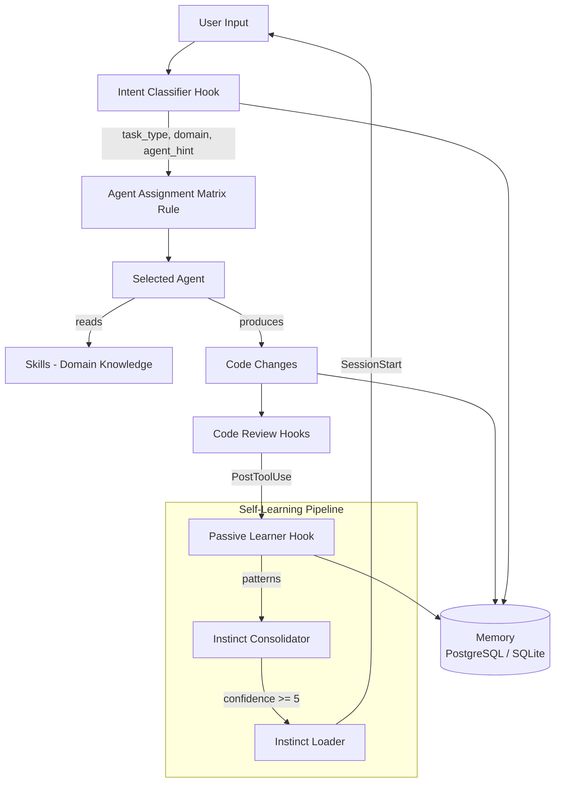

# Architecture

## 1. Overview

vibecosystem extends Claude Code with four component types that work together through implicit coordination: **hooks** observe tool calls and session events, **agents** execute specialized tasks, **skills** provide domain knowledge, and **rules** shape session-wide behavior. There is no RPC, no message bus, no service discovery. The coordination mechanism is context injection -- hooks read the environment, decide what context is relevant, and inject it into Claude Code's prompt window where agents and skills can act on it.

## 2. Component Interaction



The flow works like this:

1. User submits a prompt. The `intent-classifier` hook analyzes it and writes a classified intent (task type, domain, agent hint) to `~/.claude/cache/current-intent.json`.
2. The `agent-assignment-matrix` rule maps the classified intent to an agent.
3. The selected agent reads relevant skills (injected by hooks or referenced in its prompt).
4. After the agent produces code, `PostToolUse` hooks fire: code review, diagnostics, passive learning.
5. The passive learner captures edit patterns into `instincts.jsonl`. The consolidator groups them. Mature patterns (confidence >= 5) are auto-injected into future sessions.
6. Memory operations (PostgreSQL for structured learnings, SQLite as fallback) persist across sessions.

## 3. Hook System

### Location and Build

- Source: `hooks/src/*.ts` (61 hook files)
- Shared utilities: `hooks/src/shared/` (27 modules)
- Built with esbuild: `npm run build` produces `hooks/dist/*.mjs`
- Tests: `hooks/src/__tests__/` using vitest

Each hook is a standalone TypeScript file that compiles to a self-contained `.mjs` bundle. No shared runtime -- esbuild inlines all imports from `shared/` into each bundle.

### Hook Types

| Type | Fires When | Can Block? | Example |
|------|-----------|------------|---------|
| PreToolUse | Before a tool executes | Yes | `credential-deny`, `path-rules` |
| PostToolUse | After a tool completes | No | `passive-learner`, `post-edit-diagnostics` |
| UserPromptSubmit | User sends a prompt | Yes | `intent-classifier`, `skill-activation-prompt` |
| SessionStart | Session begins | No | `instinct-loader`, `session-start-recall` |
| SessionEnd | Session ends | No | `session-end-cleanup` |
| Stop | Agent finishes responding | Yes | `compiler-in-the-loop-stop` |
| SubagentStart | Subagent spawns | No | `canavar-subagent-tracker` |
| SubagentStop | Subagent finishes | Yes | `subagent-stop-learner` |
| PreCompact | Before context compaction | No | `pre-compact-continuity` |

### How Hooks Inject Context

Hooks communicate by returning JSON with specific fields:

```typescript
// Inject text into Claude's context window
{ "additionalContext": "Relevant information for this prompt..." }

// Block a tool call
{ "permissionDecision": "deny", "reason": "Credential detected in command" }

// Write to shared state files that other hooks read
writeFileSync('~/.claude/cache/current-intent.json', JSON.stringify(intent));
```

### Key Hooks

| Hook | Type | Purpose |
|------|------|---------|
| `intent-classifier` | UserPromptSubmit | Classifies prompt into task type, domain, agent hint |
| `passive-learner` | PostToolUse | Captures edit/file patterns from tool usage |
| `instinct-consolidator` | Stop | Groups patterns, promotes mature ones |
| `instinct-loader` | SessionStart | Injects learned patterns into session context |
| `canavar-error-broadcast` | PostToolUse | Propagates agent errors to team-wide ledger |
| `plugin-registry` | PreToolUse | Checks `plugin-config.json` to enable/disable components |

## 4. Agent System

### Format

139 Markdown files in `agents/`, each with YAML frontmatter:

```yaml
---
name: scout
description: Codebase exploration and pattern finding
model: sonnet
tools: [Read, Grep, Glob, Bash]
---

# Scout

You are a specialized internal research agent...
```

**Frontmatter fields:**

| Field | Required | Values |
|-------|----------|--------|
| `name` | Yes | Agent identifier |
| `description` | Yes | One-line purpose |
| `model` | No | `sonnet` (default) or `opus` |
| `tools` | No | Subset of `[Read, Write, Edit, Bash, Grep, Glob, Task]` |

### Agent Routing

The `agent-assignment-matrix` rule (in `rules/agent-assignment-matrix.md`) maps task categories to agents:

| Task Category | Primary Agent | Backup Agent |
|---------------|--------------|--------------|
| React/Next.js UI | frontend-dev | designer |
| API endpoint | backend-dev | kraken |
| Bug investigation | sleuth | scout |
| Large feature (TDD) | kraken | backend-dev |
| Small fix/tweak | spark | frontend-dev |
| Documentation | technical-writer | doc-updater |

### Collaboration Chains

Agents do not call each other directly. They are chained by the orchestrator (maestro) or by rules:

```
scout (explore) -> architect (design) -> kraken (implement) -> code-reviewer (review) -> verifier (validate)
```

### Dev-QA Loop

Every task follows this cycle:

1. Developer agent implements the task
2. `code-reviewer` + `verifier` run QA checks
3. **PASS** -- move to next task
4. **FAIL** -- send feedback to developer, retry (max 3 attempts)
5. **3x FAIL** -- escalate: reassign to different agent, decompose, or defer

## 5. Skill System

### Format

284 SKILL.md files + 50 prompt.md files across `skills/` subdirectories:

```yaml
---
name: fix
description: Meta-skill workflow orchestrator for bug investigation and resolution
allowed-tools: [Bash, Read, Grep, Write, Edit, Task]
---
```

Some skills also use:

```yaml
user-invocable: true    # Can be triggered with /fix, /commit, /review, etc.
user-invocable: false   # Only injected by hooks, not directly callable
```

### How Skills Are Activated

1. **User-invocable skills**: User types `/commit`, `/fix`, `/review`, `/swarm`, etc. Claude Code matches these to the skill's name.
2. **Hook-injected skills**: The `skill-activation-prompt` hook detects file patterns and bash patterns in the current context, then injects relevant skill content via `additionalContext`.
3. **Agent-referenced skills**: Agent prompts reference skills by name. The agent reads the skill file when it needs domain knowledge.

### Skill Categories

| Category | Examples | Count |
|----------|----------|-------|
| Workflow orchestrators | fix, build, commit, review, swarm | ~15 |
| Language patterns | typescript, python, golang, kotlin, swift | ~20 |
| Framework patterns | django, springboot, react, next.js | ~15 |
| Infrastructure | kubernetes, terraform, aws, gcp, azure | ~10 |
| Security | concurrency-security, insecure-defaults, supply-chain | ~10 |
| Mathematics | 40+ skills across algebra, analysis, topology, etc. | ~45 |
| Domain-specific | saas-auth, paywall-strategy, revenuecat, elasticsearch | ~30 |

## 6. Self-Learning Pipeline

The self-learning pipeline turns repeated patterns into auto-injected context, without human intervention.

```
Edit/Write tool calls
    |
    v
passive-learner.ts          PostToolUse: extracts patterns from edits
    |                       Writes to ~/.claude/instincts.jsonl
    v
instinct-consolidator.ts    Stop hook: groups by pattern, counts repeats
    |                       confidence >= 5 -> mature-instincts.json
    |                       confidence >= 10 -> auto-generate rule file
    v
instinct-loader.ts          SessionStart: injects mature patterns into context
```

### Cross-Project Learning

Each pattern is tagged with a project hash. The consolidator tracks which projects exhibit which patterns:

- **Project-specific**: Stored in `projects/{hash}/instincts/mature-instincts.json`
- **Cross-project promotion**: Pattern seen in 2+ projects with 5+ total repeats gets promoted to `global-instincts.json`
- **Global patterns**: Injected into every session regardless of project

### Canavar Cross-Training

When an agent makes an error, the `canavar-error-broadcast` hook writes it to `~/.claude/canavar/error-ledger.jsonl`. At session start, the `instinct-loader` reads the team-wide error ledger and injects relevant lessons. One agent's mistake trains the entire team.

```
Agent error -> canavar-error-broadcast -> error-ledger.jsonl
                                              |
Session start -> instinct-loader reads -> injects as context
```

## 7. Profile System

Profiles define which agents, skills, and hooks are active. This controls token budget and session scope.

### Location

6 JSON files in `profiles/`:

```json
// profiles/minimal.json
{
  "name": "minimal",
  "description": "Core agents only - review, test, verify. Lowest token usage.",
  "agents": ["architect", "code-reviewer", "kraken", "planner", "scout", ...],
  "skills": ["build", "cli-reference", "coding-standards", "commit", ...]
}
```

### Available Profiles

| Profile | Purpose | Token Impact |
|---------|---------|-------------|
| `minimal` | Core agents only | Lowest |
| `frontend` | React/Next.js/CSS focused | Low-Medium |
| `backend` | API/DB/Auth focused | Low-Medium |
| `fullstack` | Frontend + Backend combined | Medium |
| `devops` | CI/CD, Docker, K8s, Terraform | Medium |
| `all` | Everything enabled (default) | Highest |

### How It Works

1. `vibeco profile frontend` writes disabled items to `~/.claude/plugin-config.json`
2. Every hook imports `isHookEnabled()` from `shared/plugin-check.ts`
3. If the hook is not in the active profile, it exits immediately with `process.exit(0)`
4. Skills follow the same pattern via `isSkillEnabled()`

## 8. Directory Structure

```
vibecosystem/
|-- agents/                     # 139 agent definitions (.md with YAML frontmatter)
|   |-- scout.md
|   |-- kraken.md
|   |-- sleuth.md
|   +-- ...
|
|-- skills/                     # 283+ skill directories
|   |-- fix/SKILL.md            # Workflow orchestrator skills
|   |-- commit/SKILL.md
|   |-- coding-standards/SKILL.md
|   |-- math/                   # 40+ math sub-skills
|   |   |-- linear-algebra/
|   |   |-- topology/
|   |   +-- ...
|   +-- ...
|
|-- hooks/
|   |-- src/                    # 61 TypeScript hook source files
|   |   |-- intent-classifier.ts
|   |   |-- passive-learner.ts
|   |   |-- instinct-consolidator.ts
|   |   |-- shared/             # 27 shared utility modules
|   |   |   |-- plugin-check.ts
|   |   |   |-- task-detector.ts
|   |   |   |-- project-identity.ts
|   |   |   +-- ...
|   |   +-- __tests__/          # vitest test files
|   |-- dist/                   # 61 built .mjs bundles (esbuild output)
|   |-- package.json            # Build: esbuild, Test: vitest
|   +-- tsconfig.json
|
|-- rules/                      # 20 Markdown rule files
|   |-- agent-assignment-matrix.md
|   |-- auto-skill-activation.md
|   |-- qa-loop.md
|   |-- canavar.md
|   +-- ...
|
|-- profiles/                   # 6 JSON profile definitions
|   |-- minimal.json
|   |-- frontend.json
|   |-- backend.json
|   +-- ...
|
|-- tools/
|   |-- vibeco/vibeco.mjs       # CLI tool (zero-dependency Node.js ESM)
|   +-- dashboard/              # Web monitoring dashboard (port 3848)
|       |-- server.js
|       +-- index.html
|
|-- LICENSE                     # MIT
+-- README.md
```

## 9. vibeco CLI

`tools/vibeco/vibeco.mjs` is a zero-dependency Node.js ESM CLI for managing the ecosystem.

### Commands

```bash
vibeco help                          # Show help
vibeco stats                         # Ecosystem statistics (counts, active profile)
vibeco list <agents|skills|hooks|rules>  # Browse components
vibeco list agents --search security # Filter by name/description
vibeco search <term>                 # Search agents and skills by keyword
vibeco dashboard                     # Start monitoring dashboard (port 3848)
vibeco doctor                        # Health check (hooks built? DB up? profiles valid?)
vibeco profile <name>                # Set active profile (minimal, frontend, backend, etc.)
vibeco update                        # Pull latest & reinstall
```

### Example

```bash
$ vibeco stats

vibecosystem stats
  Agents     139
  Skills     283
  Hooks      61
  Rules      20
  Profile    all
```

## 10. For Contributors

### Adding an Agent

Create `agents/my-agent.md`:

```yaml
---
name: my-agent
description: What this agent does in one line
model: sonnet
tools: [Read, Grep, Glob, Bash]
---

# My Agent

System prompt goes here. Explain the agent's role, constraints, and output format.
```

### Adding a Skill

Create `skills/my-skill/SKILL.md`:

```yaml
---
name: my-skill
description: What knowledge this skill provides
user-invocable: false
allowed-tools: [Read, Grep]
---

# My Skill

Skill content -- domain knowledge, patterns, examples, reference material.
```

Set `user-invocable: true` if users should trigger it with `/my-skill`.

### Adding a Hook

1. Create `hooks/src/my-hook.ts`:

```typescript
import { readFileSync } from 'fs';

interface HookInput {
  session_id: string;
  tool_name: string;
  tool_input: Record<string, unknown>;
}

const input: HookInput = JSON.parse(readFileSync('/dev/stdin', 'utf-8'));

// Your logic here

const output = { additionalContext: 'Injected by my-hook' };
console.log(JSON.stringify(output));
```

2. Build: `cd hooks && npm run build`
3. Register in your Claude Code `settings.json` under the appropriate hook type
4. Test: `cd hooks && npm test`

### Running Tests

```bash
cd hooks
npm install
npm test          # Run all tests once
npm run test:watch # Watch mode
npm run check     # TypeScript type checking (no emit)
```

### Project Conventions

- Hooks read stdin (JSON), write stdout (JSON). No HTTP, no sockets.
- Agents are pure Markdown. No executable code in agent files.
- Skills are pure Markdown. Domain knowledge only.
- Rules are pure Markdown. Loaded into every session's context window.
- All shared state goes through the filesystem (`~/.claude/cache/`, `~/.claude/canavar/`, etc.).
