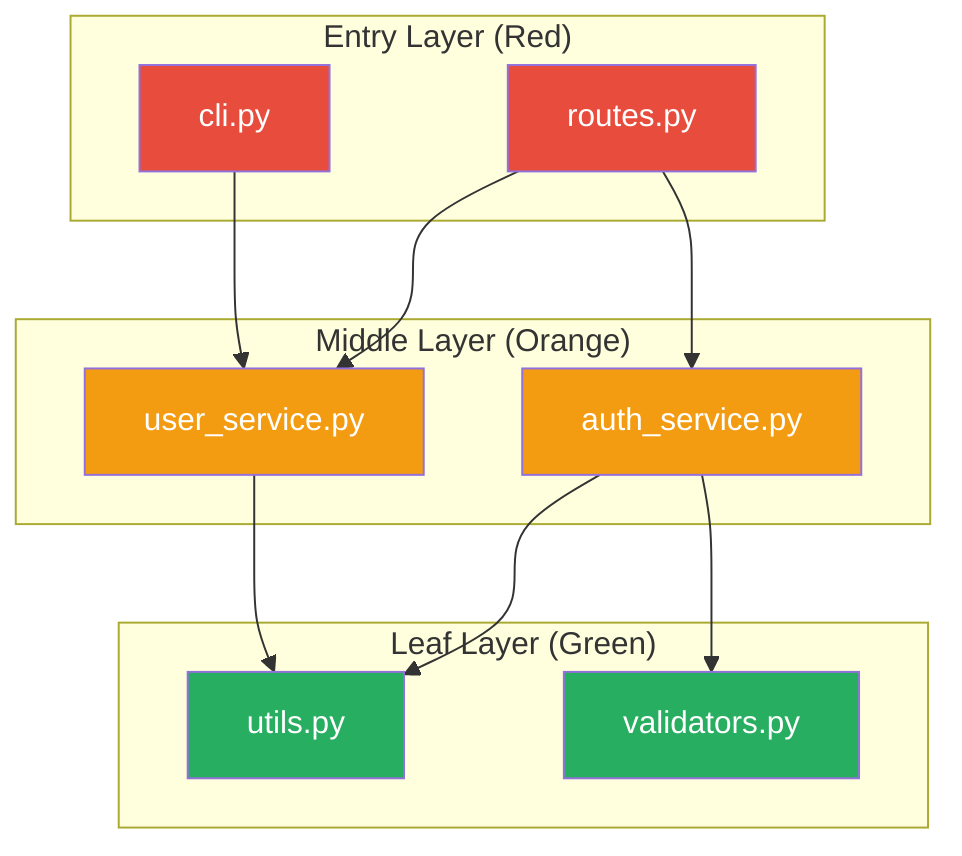
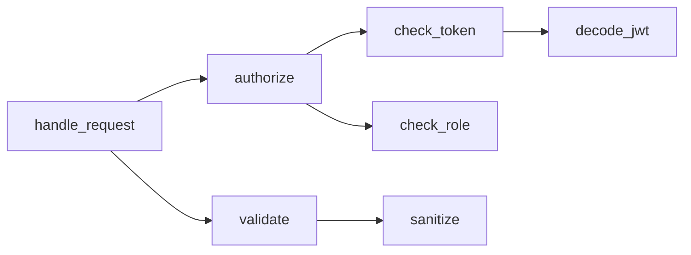
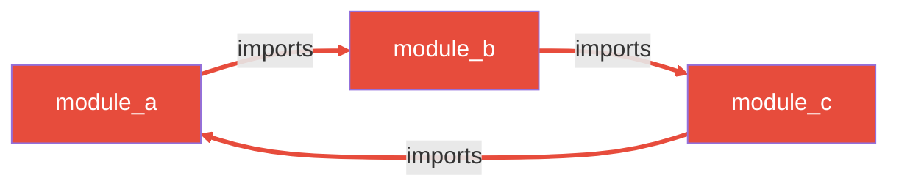
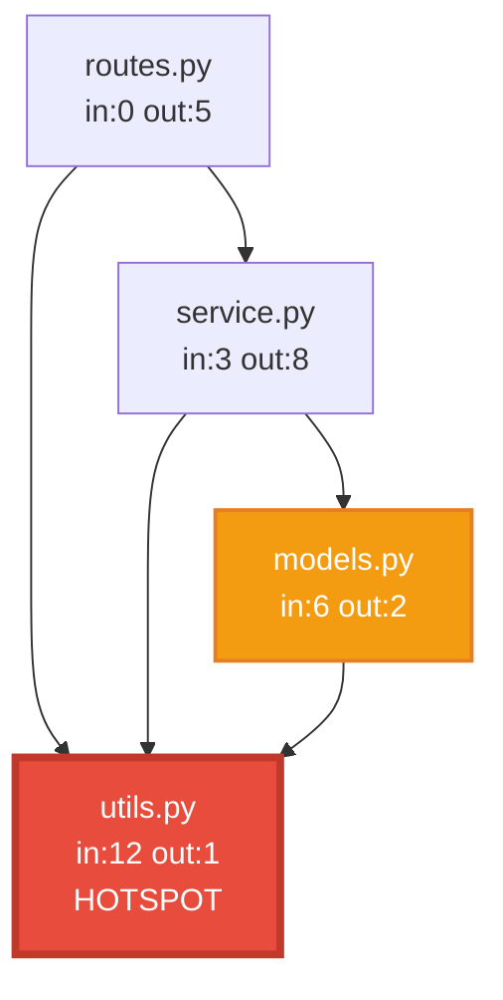

# Code Knowledge Graph - Codebase Graph Analysis

Codebase'i knowledge graph olarak modeller. Dosya, modul, fonksiyon ve class'lar node; import, call, inheritance ve composition iliskileri edge olur. Sonuc: Mermaid diagram + JSON graph data.

## Neden Knowledge Graph?

Kod text degil, **graph**'tir. Her dosya diger dosyalara baglidir. Bu baglantilari anlamadan:
- Refactoring yaparken neyi kiracagini bilemezsin
- Dead code'u guvenle silemezsin
- Yeni feature'in nereye oturacagini gormezsin
- Circular dependency'lerin kokunu bulamazsin

Knowledge graph tum bu iliskileri gorsellestirir ve olculebilir yapar.

## Kullanim

```
/code-knowledge-graph [hedef-dizin] [--focus module] [--depth N] [--format mermaid|json|both]
```

### Ornekler

```bash
# Tum codebase analizi
/code-knowledge-graph src/

# Belirli module odaklan
/code-knowledge-graph src/ --focus auth

# Sadece circular dependency kontrolu
/code-knowledge-graph src/ --focus circular

# Hotspot analizi
/code-knowledge-graph src/ --focus hotspots

# Orphan/dead code tespiti
/code-knowledge-graph src/ --focus orphans
```

## Graph Olusturma Adimlari

### Adim 1: Node Discovery

```bash
# Dosya agaci
tldr tree ${PATH:-src/} --ext .py

# Kod yapisi: fonksiyonlar, class'lar, export'lar
tldr structure ${PATH:-src/} --lang python
```

Her dosya, class, fonksiyon ve export bir **node** olur.

### Adim 2: Edge Extraction

```bash
# Dosyanin import'lari (outgoing edges)
tldr imports ${FILE}

# Modulu kim import ediyor? (incoming edges)
tldr importers ${MODULE} ${PATH:-src/}

# Cross-file call graph
tldr calls ${PATH:-src/}
```

Her import ve fonksiyon cagrisi bir **directed edge** olur.

### Adim 3: Layer Detection

```bash
# Architectural layer analizi
tldr arch ${PATH:-src/}
```

Node'lar 3 katmana ayrilir:

| Katman | Tanim | Ornekler |
|--------|-------|---------|
| Entry | Disaridan cagirilan, ici cagirmayan | routes, cli, main, handlers |
| Middle | Hem cagrilan hem cagirir | services, business logic |
| Leaf | Cagirilan ama baskasini cagirmayan | utils, helpers, constants |

### Adim 4: Impact Analysis

```bash
# Bu fonksiyona kim bagimli?
tldr impact ${FUNCTION} ${PATH:-src/} --depth 3

# Dead code: hicbir yerden cagrilmayan fonksiyonlar
tldr dead ${PATH:-src/}
```

### Adim 5: codebase-memory MCP Entegrasyonu

codebase-memory MCP kuruluysa, persistent graph sorgusu yap:

```
mcp: index_status       -> Repo index durumu
mcp: index_repository   -> Repo'yu indexle (yoksa)
mcp: query_graph        -> Graph sorgusu (iliskiler)
mcp: search_graph       -> Pattern arama
mcp: get_architecture   -> Mimari genel bakis
mcp: trace_call_path    -> Fonksiyonlar arasi cagri yolu
```

MCP, session'lar arasi kalici graph verisi saglar. tldr ise anlik taze analiz verir. Ikisini birlikte kullan.

## Dependency Analysis Pattern'leri

### Direct Dependencies
A dogrudan B'yi import ediyor:
```
A --import--> B
```

### Transitive Dependencies
A, B'yi import ediyor, B de C'yi import ediyor. A, C'ye transitif bagimli:
```
A --import--> B --import--> C
A ....transitif....> C
```

Transitive dependency chain'i uzadikca risk artar. `tldr impact` ile transitif zincirleri gor.

### Fan-In vs Fan-Out

| Metrik | Yuksek Degerin Anlami | Risk |
|--------|----------------------|------|
| Fan-In (in-degree) | Cok modul buna bagimli | Fragile - degisiklik cascade yapar |
| Fan-Out (out-degree) | Bu modul cok seye bagimli | Unstable - disaridan kirilabilir |

**Hedef**: Leaf node'larda yuksek fan-in (iyi - utility), entry node'larda yuksek fan-out (kotu - god module).

## Circular Dependency Cozme Stratejileri

Circular dependency = A imports B, B imports A (dogrudan veya transitif).

### Strateji 1: Extract Interface
```
ONCE: A <--> B (circular)
SONRA: A --> IB <-- B (interface ile decouple)
```

Her iki modul de bir interface'e bagimli olur, birbirine degil.

### Strateji 2: Dependency Inversion
```
ONCE: A --> B --> A (circular)
SONRA: A --> B, A <-- C (C yeni modul, B'nin A'ya ihtiyac duydugu kismi tasir)
```

### Strateji 3: Extract Shared Module
```
ONCE: A <--> B (ortak kod paylasiyor)
SONRA: A --> Shared <-- B (ortak kod ayri module)
```

### Strateji 4: Event-Based Decoupling
```
ONCE: A --> B --> A (geri cagri)
SONRA: A --> EventBus <-- B (event ile haberlesme)
```

### Hangi Stratejiyi Sec?

| Durum | Strateji |
|-------|----------|
| Type/interface paylasimi | Extract Interface |
| Fonksiyon geri cagrisi | Dependency Inversion |
| Ortak utility kodu | Extract Shared Module |
| Async bildirim ihtiyaci | Event-Based Decoupling |

## Hotspot Analizi ve Refactoring Onceliklendirme

Hotspot = Graph'ta en cok baglantisi olan node.

### Hotspot Skorlama

```
hotspot_score = (in_degree * 2) + out_degree + (change_frequency * 3)
```

- `in_degree * 2`: Bagimli modul sayisi (en onemli - cascade risk)
- `out_degree`: Bagimlilik sayisi (kirilganlik)
- `change_frequency * 3`: Git log'dan degisiklik sikligi (degisen hotspot = en tehlikeli)

### Refactoring Oncelik Matrisi

| Hotspot Tipi | Oncelik | Aksiyon |
|-------------|---------|--------|
| Yuksek in-degree + sik degisen | P0 CRITICAL | Hemen split et, test ekle |
| Yuksek in-degree + stabil | P2 MEDIUM | Test ekle, dikkatli degistir |
| Yuksek out-degree | P1 HIGH | Dependency'leri azalt, facade pattern |
| Yuksek her ikisi | P0 CRITICAL | God module - parcala |

### Change Frequency Analizi

```bash
# Git log'dan en cok degisen dosyalar
git log --format=format: --name-only --since="6 months ago" | sort | uniq -c | sort -rn | head -20
```

Cok degisen + cok baglantili = en yuksek risk.

## Mermaid Diagram Ornekleri

### Dependency Graph (Layered)



### Call Graph



### Circular Dependency (Highlighted)



### Hotspot Visualization



## Graph-Based Code Review

Knowledge graph review'da su sorulari cevaplar:

1. **Impact sorusu**: "Bu degisiklik kac modulu etkiler?"
   ```bash
   tldr impact changed_function src/ --depth 3
   ```

2. **Coupling sorusu**: "Bu yeni import cycle yaratir mi?"
   - Mevcut graph'a yeni edge ekle, cycle kontrol et

3. **Cohesion sorusu**: "Bu modul cok mu fazla is yapiyor?"
   - Out-degree > 8 ise muhtemelen evet

4. **Dead code sorusu**: "Bu fonksiyon gercekten kullaniliyor mu?"
   ```bash
   tldr impact function_name src/
   ```

## Onboarding Icin Graph Kullanimi

Yeni developer'a codebase'i tanitmak icin:

1. **Buyuk resim**: Layer diagram'i goster (entry/middle/leaf)
2. **Kritik yollar**: En onemli call chain'leri goster
3. **Hotspot'lar**: "Bu dosyalara dokunurken dikkatli ol" listesi
4. **Moduller**: Her modulu 1 cumle ile acikla + bagimliliklari goster

## Architectural Decision Support

Graph verisi mimari kararlari destekler:

| Karar | Graph Verisi |
|-------|-------------|
| "Bu modulu bolmeli miyiz?" | In-degree + out-degree + LOC |
| "Microservice siniri nerede?" | Cluster analizi (yuksek ic baglantilar, dusuk dis baglantilar) |
| "Hangi modulu once refactor edelim?" | Hotspot score siralamasina bak |
| "Yeni feature nereye oturur?" | Mevcut layer'a ve dependency pattern'ine bak |
| "Bu dependency guvenli mi?" | Transitif dependency chain'ine bak |

## tldr CLI Komut Referansi

| Komut | Kullanim | Cikti |
|-------|---------|-------|
| `tldr tree [path]` | Dosya agaci | JSON |
| `tldr structure [path] --lang X` | Kod yapisi (codemaps) | JSON |
| `tldr calls [path]` | Cross-file call graph | JSON |
| `tldr impact <func> [path]` | Reverse call graph | JSON |
| `tldr dead [path]` | Dead/orphan code | JSON |
| `tldr arch [path]` | Layer detection | JSON |
| `tldr imports <file>` | Dosyanin import'lari | JSON |
| `tldr importers <module> [path]` | Modulu kim import ediyor | JSON |

## JSON Graph Data Formati

```json
{
  "metadata": {
    "project": "project-name",
    "analyzed_at": "2026-03-26T10:00:00Z",
    "total_nodes": 45,
    "total_edges": 128,
    "languages": ["python"]
  },
  "nodes": [
    {
      "id": "src/auth/service.py::AuthService",
      "type": "class",
      "file": "src/auth/service.py",
      "layer": "middle",
      "in_degree": 5,
      "out_degree": 3,
      "is_hotspot": true,
      "is_orphan": false
    }
  ],
  "edges": [
    {
      "source": "src/routes.py::handle_login",
      "target": "src/auth/service.py::AuthService.authenticate",
      "type": "call"
    }
  ],
  "layers": {
    "entry": [],
    "middle": [],
    "leaf": []
  },
  "circular_dependencies": [],
  "hotspots": [],
  "orphans": []
}
```

## Iliskili Araclar

| Arac | Ne Zaman |
|------|---------|
| `graph-analyst` agent | Tam graph analizi, otomatik rapor |
| `tldr arch` | Hizli layer detection |
| `tldr calls` | Hizli call graph |
| `codebase-memory MCP` | Persistent graph, session arasi sorgulama |
| `/explore architecture` | Genel mimari kesfetme |
| `architect` agent | Graph verisiyle mimari karar |
| `janitor` agent | Orphan/dead code temizligi |
